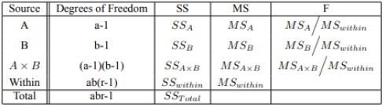

```{r setup, include=FALSE}
knitr::opts_chunk$set(echo = TRUE)
```

### Introduction
This is a whistle-stop tour of statistics and using R to analyse data and draw conclusions from it. The aim being that it can form a base for any future analysis that you could possibly want to perform. All the examples in here work with datasets built into various R packages to make re-using the code as simple as possible. I decided not to suppress any outputs so you can see exactly how it would appear in R as if you were running the code yourself. If you are not interested in using R then the TLDR sections will should give you a decent insight into statistical tests and in what situations to use them.

### TLDR: Hypotheses and Sided Tests
In statistics whenever you perform a statistical test you need to set up two hypotheses: Your *Null* hypothesis also defined as *H0* and your *Alternative* hypothesis also defined as *H1*.
You also perform your tests as one or two-tailed, this simply means what side am I looking at. At a 5% significance level: A one-tailed test will mean you are testing whether x > y (5% at top tail) or x < y (5% at bottom tail). where in a two tailed test you are testing whether x != y (so x could be < or < y) and 2.5% at each tail. When we talk about significance, this means we are comparing our p-value with this value.

Setting up your hypotheses, H0 is always your boring hypothesis - they are the same and H1 is the interesting one - they are different or  one is greater/less than, define everything before you start.

1. ***Examples***
  + *Setting the scene:* Let F denote the Weight of Flatcoated Retrievers and G denote Weight of Golden Retriever
  + *Defining H0:* Mean(F) is equal to Mean(G)
  + *Decide whether you want to do a one or two tailed test (and which side)*
  + *If one tailed:* Mean(F) is not equal to Mean(G) 
  + *If two tailed: F < G:* Mean(F) < Mean(G)
  + *If two tailed: F > G:* Mean(F) > Mean(G)
  + *State your significance level and critical value if you are manually comparing a test statistic (normally you will just use a p-value output from some sort of statistical software)*
  + *Do your statistical test*
  + *Conclude your statistical test:* From our *insert test* we have a p-value of *x* *< or >* *significance level*, *if <: hence there is sufficient evidence to reject H0 and accept H1: Restate  H1 * or *if >: hence there is insufficient evidence to reject H0: restate H0* E.g From our two-tailed paired t-test we have a p-value of 0.012 < 0.025, hence there is sufficient evidence to reject H0 and accept H1: Flatcoated Retrievers weigh more than Golden Retrievers.

2. ***Examples***
  + One-tailed test at the 5% significance level, p-value of 0.045: 0.045 < 0.05 so reject H0 and accept H1 (state).
  + Two-tailed test at the 5% significance level, p-value of 0.045: 0.045 > 0.025 so do not reject H0 (state).
  + One-tailed test at the 5% significance level, p-value of 0.051: 0.051 > 0.5 so do not reject H0(state).
  + Two-tailed test at the 5% significance level, p-value of 0.021: 0.021 < 0.025 so we reject H0 and accept H1(state).
  

### TLDR: Type I/II Errors and Choosing your Significance Level
***Type I error:***
Type I error is when you reject H0 and accept H1 when in fact H0 is the correct outcome. E.g You conclude that the study drug is effective when in fact it is not, this is the same as the significance level. This is also known as a *false positive*. This is the more dangerous error so we fix it by using a specified significance level, typically 5% gets used as this is good at controlling both type I and II errors. The lower your type I error the higher your type II error as they are directly correlated.

***Type II error:***
Type II error is when you fail to reject H0 when you should reject H0. E.g You conclude the study drug is ineffective when it fact is has an effect. This is also known as a *false negative*.

***Choosing a significance level:***
Remember a signifance level is effectly just your type I error and is the chance a false positive given that H0 is true. That's quite a key point, it's given H0 is true and worth remembering.
When choosing a significance level, you need to ask yourself the following question: How certain do I need to be that I am correct?
Consider the two following examples:
1. Testing whether flatcoated retriever puppies are more intelligent than spaniels. For this example you would probably choose the 5% significance level as this is best for keeping Type I and II errors relatively similar.
2. Testing whether a new cancer drug can remove the cancer but it has a 20% chance of killing the person. For this example you want to be very sure that it actually can remove the cancer as otherwise would just be killing people unnecessarily. In this example you may choose a significance level more like 0.01 or 0.005.

### TLDR: Independent/Dependent Variables
A **Dependent** variable is the one being measured in the experiment and the **Independent** variable being changed throughout the experiment. In the simplest terms **Dependent** variable is the y-axis and the the **Independent** variable is the x-axis. If you have trouble remembering, just remember the Dependent variable **DEPENDS** on your other variable and the Independent variable follows from this. Alternatively, you can think of it in terms of **cause** and **effect** where the independent variable is cause and the dependent variable is effect.

### TLDR: Assumptions

1. ***One Sample T-test:*** Tests the mean of a single group against a known mean
  + Data can be modelled by a normal distribution
  + homogeniety of variance (variances are the same)
  + data is representative of the entire population (independence)
  + A large enough sample size is used.

2. ***Independent Samples T-test:*** Compares the means for two groups
  + Independent  observations
  + Normally distributed
  + Homogeneity of the variance

3. ***Paired Two-sample T-test:*** Compares means from the same group at different times/circumstances
  + The dependent variable must be continuous (interval/ratio).
  + The observations are independent of one another.
  + The dependent variable should be approximately normally distributed.
  + The dependent variable should not contain any outliers.
  
3. ***Wilcoxon Sign ranked test*** Compares two repeated measurements on a rankable scale
  + Data is paired and comes from the same population
  + Independence of pairs (each pair is chosen randomly and independently)
  + Data is measured on a rankable scale (interval/ordinal) on the differences
  
4. ***F-test*** Used to test if two variances are equal
  + Both populations are normally distributed
  + The two populations are independent of each other

5. ***Mann-Whitney U-test***
  + All observations from both groups are independent of each other
  + Responses are ordinal (you can say which one is greater)
  + Under H0, distributions of of both populations are equal
  + Under H1, distributions are not equal

6. ***One-way Anova test*** Used to compare the means of two or more groups with respect to 1 factor
  + Variances of populations are equal
  + Responses for each group are independent and identically distributed (IID) 
  + The residuals of the response variable are normally distributed (~approx~).

7. ***Kruskal-Wallis test*** Used to compare means of two or more groups with respect to 1 factor if the assumptions of a one-way anova aren't met

8. ***Two-way Anova test*** Used to compare the mean differences betweens groups that have been split on two factors, note also tests for interaction between the factors.
+ Your dependent variable must be continous
+ Both your factors should contain two or more levels (groups) 
+ Dependent (response) variable should be approx normally distributed for each combination of levels
+ Observations should be independent
+ Homogeneity of variances for each combination of levels

### TLDR: Statistical Tests

###### ***One-Sample T-test***
This is used when you want to test whether the population mean of a variable is equal to a particular value, you do this by taking a sample from that population and then running the test on the sample. Where your null hypothesis will be that the population mean is = x and the null hypothesis that it is either not equal to x, < x or > x For example, you want to see if the average birth weight of flatcoated retriever puppies is equal to 1Kg, you can't possibly weigh every puppy born so you would need to take a sample from all flatcoated retriever puppies. For questions on this think how the assumptions may not be satisfied, you would need to pick the puppies independently (You couldn't just weigh the puppies from one litter as this would violate assumption 3, puppies are not necessarily representative of the whole population).

###### ***Independent Samples T-test***
This is used when you want to test the means for two groups, for example you may want to know if the birth weight of flatcoated retriever puppies is the same from two different breeders. Again you need to make sure all the assumptions are met, in this case you would need to make sure the puppies are independent again, for example not just taking the measurements from one litter from each breeder but sampling across all litters from each breeder.

###### ***Paired Two-sample T-test***
This is used when you want to test the means from one group at two separate time points, for example you want to test if attending Brownsey's puppy training course has will improve the obedience of your puppy. You have the obedience scores for all the puppies at two time points from a previous course: 1 ~ before attended the training and 2 ~ after you have attended the training. Here you will have your null hypothesis that there is no difference in the puppy's obedience scores after the training and your null hypothesis would be the scores after the training is greater than those before the puppy training. Remember to check all your assumptions - in this case you could have the assumption of no outliers is not satisfied (you have 2 flatcoats in your obedience class with really high obedience scores!)

###### ***Wilcoxon Sign ranked test***
This is used instead a Paired Two-Sample T-test if it's assumptions are not satisfied, for example when the scores of puppy's are not normally distributed/contains outliers due to flatcoats being really smart dogs and having scores much higher than all other breeds! Example would be the same.


###### ***F-test***
This is used to test whether two population variances are equal. For example you want to test if the variance in Puppy Weight is equal between two breeds: Flatcoated Retrievers and Golden Retrievers!
Your null hypothesis is the variances of the two breeds weights are equal and your alternative hypothesis that the variances are different (Two-tailed) or you can specify Flatcoated Retrievers have a larger variance than Golden Retrievers if you want it to be one-tailed.
Again making sure the assumptions are met.

###### ***Mann-Whitney U-test***
Used to compares differences between two independent groups when the data is not normally distributed, used when you can't satisfy the assumptions of an Independent Samples T-test, Example would be the same.

###### ***One-way Anova test***
This is used to compare the means of two or more groups samples (using F-distribution), remember H0 is always the means come from the same population e.g. mean(a) = mean(b) = mean(c) and H1 is always that atleast one of the means is different.
Example: You have 4 breeds of dogs and you want to test which dog scores highest in agility, you have the following breeds: Flatcoated Retriever, Cocker Spaniel, Springer Spaniel and Golden Retriever, this is your factor. You set out H0: Mean score in agility is the same for all breeds vs H1: Atleast one of the means is different. 

###### ***Kruskal-Wallis test***
You use this whenever the assumptions for a One-way Anova are not met: e.g Variances of the populations are not equal. Example would be the same.

###### ***Two-way Anova test***
This is used to compare outcomes when there are two factors involved for example, dog intellengence is measured on a continuous scale from 1:100 and we think that there are two factors that affect this: Gender and breed. Similar to the One-way example above except in this case we have two factors and it would be split out into Flatcoat Retriever Male, Flatcoat Retriever female ,...,Golden Retriever female.
From the table output from this, you can perform 3 sets of hypothesis tests:
1. H0: The population means of the first factor are equal. H1: Atleast 1 is not equal
2. H0: The population means of the second factor are equal. H1: Atleast 1 is not equal
3. H0: There is no interaction between the two factors. H1: There is an interaction between the two factors.

### TLDR: Analysis
How to analyse data and choose which test is most appropriate.

1. Step 1: Import your data
2. Step 2: Check what type of data you have:
+ When running this step think about the hypothesis you are going to be asking and tailor questions accordingly but the standard ones I would personally use are:
+ Is it paired?
+ Is it normally distributed?
+ Do they have same variances? 
+ Are they independent?
3. Step 3: check the assumptions of your data against the assumptions of the different tests and choose which test fits your data in the best way and check any extra assumptions of the test you want to use.
4. Step 4: Set out your null and alternative hypotheses and significance level *BEFORE* you do the test.
5. Step 5: Run the code for the test and draw a conclusion for whether you are accepting null or alternative hypothesis.

##### Examples

1. Example 1:
* Is the data paired: No
* Is the data normally distributed: Run Shapiro test: No
* Do they have the same variance: N/A
* Are they independent? Yes
* Run Mann-Whitney U test.

2. Example 2:
* Is the data paired: Yes
* Is the data normally distributed: Run Shapiro test: Yes
* Do they have the same variance: Run F-test: Yes
* Are they independent? Yes
* Think about using paired two-sample t-test, but first just check extra assumptions for this:
* Does the dependent variable contain any outliers? No
* Is the dependent variable continuous? Yes
* Extra assumptions satisfied -> use paired two-sample t-test.


### TLDR: Understanding and analysising the Two-way Anova Table
Understanding where all the values come from in an Anova table is useful and actually very easy.
First I will generate a two-way Anova output using R:

```{r}
data <- ToothGrowth
data$dose <- factor(data$dose, levels = c(0.5,1,2),labels = c("D0.5","D1","D2"))
str(data)
anova3 <- aov(len ~ supp * dose, data = data)
summary(anova3)
```

\

Now let's break down what each of the values mean using both of the above outputs:

###### ***Source***
This column is basically your factors, A is factor 1, B is factor 2 and A*B is equal to the interaction of the two factors. You can think of the within as what's left.

###### ***Degrees of Freedom***
The total is equal to the total number of data observations you have - 1. In this case we have 60 observations and the Df column sums to 59.
A: Now we can see that supp is a factor with two levels this means supp can take one of two values - for example if it was gender it could take values Male and Female - so it has two levels. DoF is denoted by number of levels - 1 which gives: 2 - 1 = 1.
B: Same for B except this is a factor with three levels, for example dog breed: Flatcoat, Spaniel, Golden retriever and gives 3 - 1 = 2.
A x B: This is equal to A x B in this case 1 x 2 = 2.
Within (Residuals): This is equal to the total (59) - (A + B + A x B) = 59 - 5 = 54
So once you know a couple it is very easy to work out the missing DoF should you need to from applying the above formula and re-arranging to find the unknown DoF.

###### ***Sum of Squares (SS)***
This is basically the dispersion of the data in each of the groups and is calculated by summing each observation - the mean squared.
Here it's worth noting the Total Sum of Squares is equal to the summation of all the others: SStotal = (SSa + SSb + SSaxb + SSwithin)

###### ***Mean Squares (MS)***
This is given by the SS / DoF and works horizontally. I.E MS for dose = 2426.4 / 2 = 1213.2

###### ***F-Value***
This is calculated by taking the row MS and dividing by the the Within MS: E.g the supp dose F-value is: 205.4/13.2 = 15.572
To calculate whether this is signicant you can either use the Pr(>F) output from the R-code and compare this with your chosen significance level. Or if you are not using R you would take your F-value and compare it with the critical value found in the statistical tables.

###### ***Critical-value***
The critical value can be calculated using the F-distribution:[Tables](http://users.sussex.ac.uk/~grahamh/RM1web/F-ratio%20table%202005.pdf)
You take the DoF of the Factor as the first one and the DoF of the Within (Residuals) as your second value and then read it off the table above.

### Ways of Comparing Results
There are lots of ways of comparing results in general. In clinical trial papers you will tend to find: Risk Difference >  Odds Ratio > Risk Ratio in terms of how often they are used.
Each method has it's pros and cons and has it's own confidence interval but in general, so long as you define which method you are going to use upfront and stick to it you will be fine. Do bear in mind depending on which method you use could lead to a different outcome for your comparison. Below is a brief explanation of each one:

###### ***Risk Difference***
This is probably used most as it is in terms of absolute values, which in general are easier for people to quantify and visualise.
It is denoted as the difference the incidence in the exposed group - the incidence in the control group. Where incidence is denoted by number of events in that group divided by total number of participants in that group. If they is no difference then you will expect an outcome value near to 0.

###### ***Risk Ratio***
This is similar to Risk Difference except that instead of taking the incidence in the exposed group and taking away the incidence in the control group you instead divide by the control group. In this case if there is no difference you will expect a value near to 1.

###### ***Odds Ratio***
The Odds Ratio is slightly more complex, it quantifies the strength of the association between two events. In other words: The ratio of the odds of A in the presence of B and the odds of A in the absence of B. Note: it doesn't matter which way around you look at this due to symmetry. If the Odds Ratio is > 1 it implies that A and B are *positively* correlated: The presence of B raises the odds of A and visa versa. IF the Odds Ratio is < 1 it implies that A and B are *negatively* correlated: The presence of B reduces the odds of A and visa versa.
This is given by the ratio of diseased in exposed over control divided by ratio of healthy in exposed over control. The key difference here between this and the risk ratio is the denomitor here is healthy numbers instead of total numbers in each population. The further away from 1  the larger  the association between the two groups. A value of 1 would suggest that there is no association between the two.

### Setup:
Before you start using R, you need to do two things:

1. Install R onto your computer: [R download](http://cran.us.r-project.org/)

2. Install R-Studio: [R-Studio download](https://www.rstudio.com/products/rstudio/download/)

### Importing data and loading libraries
This subsection will take you through how to load libraries and also how to import datasets into R, but in reality you probably want to use the built in Import Dataset functionality in R-studio which can import the following files types: Excel, SPSS, SAS, Strata, Text - it will also produce the code required if you wanted to reimport it again in the future.
You can access this by clicking on the import data set button in R-studios Environment tab, then you can select your file type from the drop-down list. All that's left to do is then browse for your file and press import.
```{r}
#installing a package (commented out as i've already installed it)
#install.packages("tidyverse")
#If the error: there is no packaged called 'x' then you need to install it and rerun library command
#loading each package individually
library(tidyverse)
#loading a list of packages
x <- c("leaps","survival","haven","broom","car")
lapply(x, library, character.only = TRUE)
```
Some example code, commented out to just demostrate the shell code - one thing worth remember is you always need to include the suffix (.csv)
```{r}
#reading in a .csv
#read_csv("path to .csv")
#read_sas("path to .sas")
#read_csv("/scratch/gantt/demo.csv")
```
### Summarising and plotting basic data
Say we have a dataset with lots of data in, then we may want to summarise it into a table or plot it to help us visualise it better. There are lots of ways to summarise data but the summarise function has the following useful functions: mean(), median(), sd(), IQR(), min(), max(),quantile(),first(),last(),nth(),n(). It also has some others but these are the ones I expect you may use, for a full list use ?summarise and select the 2nd option.
```{r}
#A subset of the functions you can use inside the summarise call, just add as required.
sleep %>% 
  group_by(group) %>%
  summarise(
    count = n(),
    mean = mean(extra),
    sd = sd(extra)
  )
```
Plotting the data, first we are just going to plot two point charts

```{r}
ggplot(sleep, aes(x = ID, y = extra, colour = group))+
  geom_point() #note:5 on top of each other, geom jitter can help
ggplot(sleep, aes(x = ID, y = extra, colour = group))+
  geom_jitter()
```

We can also look at densities if we would like to as demonstrated below, first graph is what i'd tend to look at, second is just to show fill = group and adding a theme as I'm not a fan of the default grey lines personally.

```{r}
ggplot(sleep, aes(x = extra, colour = group))+
  geom_density() 
ggplot(sleep, aes(x = extra, colour = group,fill = group,alpha = 0.5))+
  geom_density() + theme_classic()
```

### Checking normality and looking at QQ plots
Firstly, lots of stats tests and techniques rely on the underlying assumption that the data is normal. We can use the shapiro test to check if a variable in this our case "extra" is normal. The test works under the null hypothesis that it is normal and alternative hypothesis it is *not* normal. So if our p-value <0.05 we would say that it was not normal and otherwise we have insufficient evidence to reject that it is normal.
```{r}
shapiro.test(sleep$extra)
```
Another way to visualise whether it is normal is to use a Quantile-Quantile (QQ) plot, an easy way to think of these is as percentiles and that if it does come from a normal distribution then it will be roughly straight (never actually straight as there is always random error so do bear that in mind).
```{r}
qqnorm(sleep$extra)#can do more in ggplot2
ggplot(sleep, aes(sample = extra)) + stat_qq() 
#make the group into factors for the ggplot
sleep$group <- as.factor(sleep$group)
ggplot(sleep, aes(sample = extra, colour = group)) + stat_qq()
```

### t-tests
We'll cover two types of T-test here: 1) Welch's where the variance is *not* assumed to be the equal and the students t-test where the variances are assumed to be equal. This does make a slight difference to the test statistic so it is worth being sure which one you want to use.
In each case the null hypothesis will be x and y are the same and the alternative hypothesis will be they are different. By default this is two sided, i.e H0: x = y H1: x != y, you can easily side the hypothesises as I'll show below. H1: x > y or x < y, it is important to think about which way around you are expecting it to be as it'll always do the difference of x - y. Paired is also set to false by default.
A very useful package is the broom package - this contains the function tidy which gathers the output of these tests and displays it in a much more user-friendly manner
Some basic t-tests:
```{r}
#Welch two-sided t-test
t.test(extra ~ group, sleep)
#Welch one-sided t-test
t.test(extra ~ group, sleep,alternative = "less") #alternative = c("two.sided", "less", "greater"),
#student's variance assumed equal
t.test(extra ~ group, sleep, var.equal=TRUE)
#demonstrate tidy - a useful function for getting the data out in a useable format
tidy(t.test(extra ~ group, sleep, var.equal=TRUE))
#paired students T-test.
tidy(t.test(extra ~ group, sleep, var.equal=TRUE,paired = TRUE))
```
We can also use t-tests to test for a difference between two variables. For example we would be testing that x - y = 0.5 for example. Again we do this as either a one-sided or two-sided hypothesis test, where are null hypothesis would the difference between x and y is = 0.5 for example. 
```{r}
#testing that extra is = 0 for all observations, 1:20
t.test(sleep$extra, mu = 0)
#breaking the extra column into two columns in a new tibble (tidyverse dataframe)
sleep_data <- tibble(ID=1:10,
                     group1=sleep$extra[1:10],
                     group2=sleep$extra[11:20])
#looking at each group individually
t.test(sleep_data$group1, mu = 0) #one sample t-test
t.test(sleep_data$group2, mu = 0)
#Now looking at the difference between the two variables
tidy(t.test((sleep_data$group2 - sleep_data$group1), mu = 0.5))
tidy(t.test((sleep_data$group2 - sleep_data$group1), mu = 0.5,alternative = "greater"))
#in clinical trials they'll test for non-inferiority first and then 
#if that is satisfied they may also test for superiority
tidy(t.test((sleep_data$group2 - sleep_data$group1), mu = 1.5)) %>%
  select(statistic:p.value)#:is shorthand for all rows between statistic and p.value inclusive
```

### Taking account of NAs and ignoring some data
There are two ways in general to take account of NAs in the base data and inside the function call.
In general it is much better coding practice to define a new/over-write existing variable with the data you want to include in the method call as you can check this data much easier and can be re-used easily.
```{r}
#If we try to summarise this data we won't be able to as there are some NAs in the underlying data
airquality %>% group_by(Month) %>%
  summarise(
    mean = mean(Solar.R),
    sd = sd(Solar.R)
  )
#In the function call:
airquality %>% group_by(Month) %>%
  summarise(
    mean = mean(Solar.R,na.rm = TRUE),
    sd = sd(Solar.R, na.rm = TRUE)
  )
#Overwriting the base data to have NAs removed:
air_quality <- airquality %>%
filter(!is.na(Solar.R) , !is.na(Ozone))
#Then we can call the first function and the NAs won't be a problem as we have removed them
```
Now you may have a large dataset but only be interesting in a subsection of it, in this example we are only interesting in June and July, you could do the subsetting inside the t-test but it's really bad practice so will only demonstrate the subsetting outside of the t-test.
```{r}
#filtering data to just contain the data for June and July
air_quality <- airquality %>%
  filter(!is.na(Solar.R), Month %in% c(6,7))
#Here null hypothesis is there is no difference in solar value between June and July and alternitive would be that June is lower than July.
tidy(t.test(air_quality$Solar.R ~ air_quality$Month,p.value = 0.1,alternative = "l",conf.level = 0.9))
```
We checked to see if data was normal earlier but we can also check to see whether the variances are equal between two Months.

```{r}
#prepping the data
aq_paired <- air_quality %>% 
  # selecting the variables we are interested in
  select(Day,Month, Solar.R) %>% 
  # spreading the data by month
  spread(Month,Solar.R) %>%  
  # as differing number of days so only want to compare when there are results for both months
  slice(1:30) %>% 
  #names as numbers are not good in r as will recognise as numeric not character
  rename(month6 = "6", month7 ="7")
  #when renaming it's always the new name on the left and old name on the right throughout the tidyverse

aq_paired
#running a variance test - this is also known as an F-test, where it checks if two populations have the same variance - if value is  < significance level conclude variances not equal, otherwise conclude variances are equal.
tidy(var.test(aq_paired$month6,aq_paired$month7)) %>%
  select(statistic, p.value)
```
Now from this you have the skills to test whether the data is normal and if the variances are equal, if so great we use a t-test. But if the data is not normal then we can't use a t-test as it will lead to bias's, instead a better test to use would be the Wilcoxon sign-ranked test. One thing you need to consider with Wilcoxon is how to consider rows where results are the same for both months. If you try and include this by default it will error. You either need set exact = FALSE if you have this situation and want to run a wilcox sign-ranked test.
We do this if the two data groups are paired (dependent on each other).
```{r}
#first errors
tidy(wilcox.test(aq_paired$month6 , aq_paired$month7, paired = TRUE, alternative = "two.sided"))
#adding the exact = FALSE 
tidy(wilcox.test(aq_paired$month6 , aq_paired$month7, paired = TRUE, alternative = "two.sided"
                 , exact = FALSE, conf.int = 1, conf.level = 0.1))
```
If the two groups of data are independent of each other then we would use the Mann-Whiteney U test also known as Wilcoxon rank-sum test, or Wilcoxon–Mann–Whitney test. This is quite an important distinction and it is one people tend to confuse alot - especially since in R they use the same base method (wilcox.test).
```{r}
 wilcox.test(mpg ~ am, data = mtcars) 
```
### Kruskal Wallis
This is basically a non-parametric alternative to a one-way ANOVA test, which is an extension of the Wilcoxon test, in other words more than two groups of data. We would tend to use this when the assumptions for an ANOVA test are not met.
Under this test we have a null hypothesis: There is no difference between the groups and H1: there is a difference in atleast one of the groups.

```{r}
kruskal.test(weight ~ group, data = PlantGrowth)
```
Since we get a p-value of 0.01842 we can conclude: P < 0.05 -> there is sufficient evidence to reject H0 and accept H1, there is a difference in atleast one of the groups. When performing a test of any sort the above way is a good way of phrasing your conclusion as there is always a chance that you are including the wrong thing.
This is great... We know there is a difference between atleast one of the groups... but we don't know which groups are different. To find this out we can use a pairwise wilcxoxon test, this calculates the pairwise comparisons between group levels with corrections for multiple testing.
```{r}
pairwise.wilcox.test(PlantGrowth$weight, PlantGrowth$group,
                 p.adjust.method = "BH")
```
Shows that only trt1 and trt2 are significantly different.
In this example a nice way to visualise can be with a boxplot:
Now I would never suggest actually using this boxplot but it just contains the code you can use tweak it.
Note, if you want to edit fill or colour it needs to be contained within the aes(), statement, if you don't want them, just remove out of the aes statement.
When editing stuff like colour, the aes() statement needs to be inside the geom_boxplot, if it was inside the ggplot() it would error as it would try and pass the aes into the scale_colour/fill.
```{r}
PlantGrowth %>%
  ggplot() +
  geom_boxplot(aes(x = group, y = weight, colour = group, fill = group),
               outlier.colour = "red", outlier.shape = 8, outlier.size = 5) +
  #Note it is important to name them both "Group" if you want them to be combined
  #in the legend on the right hand side otherwise there will be 2 legends
  scale_colour_manual("Group",values = c("purple", "red","dodgerblue2")) + 
  scale_fill_manual("Group",values = c("black", "white","black")) +
  theme_classic()
```

### ANOVA
One-way ANOVA: This is essentially an extension of the independent two-samples t-test for comparing means when there are more than two groups. In this test the hypotheses are:
H0: The means of the different groups are the same.
H1: At least one of the sample means is not equal to the others.
The assumptions are: the variables are independent and identically distributed (IID)
Homoscedasticity: the dependent variable has the same variance within each population
Normality: the dependent variable is normally distributed within each population
We will use the PlantGrowth dataset again, in your case you may need to adjust the levels - see code in Kruskal Wallis section if you need to do this.
```{r}
anova1 <- aov(weight ~ group, data = PlantGrowth)
summary(anova1)  
```
From this we get pr(>F) -> the probability that it is greater than the F value and if this is less than your significance level then you want to reject your null hypothesis and accept the alternative hypothesis.
In our case the p-value is 0.0159 so it is significant: so we would conclude: 0.0159 < 0.05 so there is sufficient evidence to reject h0 and accept h1: atleast one of the means is not equal to the others.

Now, again we don't know which one is different. We can find this out by use of the Tukey multiple pairwise-comparisons using the Tukey Honest significant differences:
```{r}
TukeyHSD(anova1)
```
As expected since its the same dataset as the Kruskal-Wallis example - we can see trt2-trt1 is the only one which has a significant p-value (0.012) which less than our significance level of 0.05.
We could have also used  a paired t-test - gives the same conclusion but slightly different values.
```{r}
pairwise.t.test(PlantGrowth$weight, PlantGrowth$group,
                p.adjust.method = "BH")
```

This is great but... In order for an ANOVA test to be check the assumptions...
Let's check the homogeneity of variances:
H0: Variances the same.
H1: Variances are different.
```{r}
#library(car)
leveneTest(weight ~ group, data = PlantGrowth)
```
Since 0.34 > 0.05 you can conclude that the variances are the same, which is great this is satisfied.
For reference if this was not satisfied you could use the Welch one-way test as this does not require the  homogenity to be satisfied:
```{r}
oneway.test(weight ~ group, data = PlantGrowth)
pairwise.t.test(PlantGrowth$weight, PlantGrowth$group,
                 p.adjust.method = "BH", pool.sd = FALSE)
```
Checking normality:
Again we can use the shapiro test as we saw earlier but we just need another line to extract the residuals from it.
```{r}
residuals1 <- residuals(object = anova1)
shapiro.test(x = residuals1)
```
The outcome value is 0.4379 so we would conclude insufficient evidence to reject H0: data is normally distributed.

*Two way ANOVA*, what we saw above is a one-way ANOVA test: One variable (group) affects an outcome (weight), in a two way ANOVA, you have two variables which affect the outcome and a few different hypotheses that you can use:
1. There is no difference in the means of factor A
2. There is no difference in the means of factor B
3. There is no interaction between factors A and B

The alternative hypotheses would be: 
For 1 and 2: The means are not equal.
For 3: there is an interaction between A and B

```{r}
head(ToothGrowth)
```

Looking at the data and setting it up for a two-way Anova
```{r}
data <- ToothGrowth
#taking a look at the data
str(data)
#As you can see dose is not a factor and needs to be so we set it as a factor
data$dose <- factor(data$dose, levels = c(0.5,1,2),labels = c("D0.5","D1","D2"))
#the Anova
anova2 <- aov(len ~ supp + dose, data = data)
summary(anova2)
```
From the output, we can see that both supp and dose are statistically significant - you get this by taking the Pr(>F) column and comparing this with your signicance level  (bear in mind the above model is an additive model ~ assumes that both factors are independent)
If you think the two variables may interact then you need to change the + to a * and this will include their interaction in the anova test. If this is significant it indicates the relationships between dose and tooth length depends on the supp method.

```{r}
#the Anova
anova3 <- aov(len ~ supp * dose, data = data)
summary(anova3)
```
Above we are also testing for the interaction. In this case you can see they both variables as well as their interaction is significant (Again by looking at the Pr(>F) column and the  * next to it.
###Linear modelling
You can fit a basic y = mx + c model and graph it very easily in R, in this case we are seeing how the width of a petal affects the Length of the Sepal.
```{r}
#Graphing a linear model of y = mx + c
ggplot(iris, aes(x = Petal.Width, y = Sepal.Length)) + 
  geom_point() +
  stat_smooth(method = "lm", col = "red")
#The model fitting in the above graph is given by:
petal_lm <- lm(Sepal.Length ~ Petal.Width, data = iris)
petal_lm
```
Now lets take a look at the mtcars data set and see what effects for example miles per gallon.
In this case we can fit the basic model but we might expect more than one thing to affect mpg.
```{r}
#Basic model, let's arbitrily pick hp
my_lm <- lm(mpg ~ hp, data = mtcars)
summary(tidy(my_lm))
mtcars %>% 
  ggplot(aes(x = hp, y = mpg)) +
  geom_point()+
  stat_smooth(method = "lm", col = "red")
```

Now if you want to pick the optimal subset for each number of factors there is a library called leaps in R, this will test all combinations and find the optimum one for each number of factors up to your specified number. In general for a model, you would only choose to keep a factor if it is significant, as over-fitting a model makes for bad future predictions. It uses either forwards stepwise progression (starting with a model with no predictors) or backwards where you are starting with a model of all possible predictors. Where forwards adds the most useful predictor at each step the backwards one removes the least useful one at each step.

```{r}
summary(regsubsets(mpg ~ cyl + disp + hp + drat + wt + qsec + vs + am + gear + carb,
           data = mtcars, nvmax = 10))

summary(regsubsets(mpg ~ cyl + disp + hp + drat + wt + qsec + vs + am + gear + carb,
                   data = mtcars, nvmax = 4, method = "backward"))
```
From this we can select the number of predictors we want to use in our model and then just read off from the regsubsets output what we want. In general we will pick the largest subset such that all predictors are significant at our chosen significance leve (normally 5 or 10%).
Say I choose to go for 4 predictors:
```{r}
best_model_4 <- lm(mpg ~ hp + wt + qsec + am, data = mtcars)
summary(best_model_4)
#If i were to look at the output from the summary i'd definately be thinking about dropping hp from my model as it is not close to be significant (p = 0.22)
```
Once you have made a model you can use it to predict the mpg values for different values of hp ...
We can then plot this and overlay both the actual data and the predicted data.
```{r}
#making a subsection of our data with just the data we are interested in, not need but nice to see
predict <-(mtcars %>%
             mutate(id = row_number()) 
                             %>% select(hp,wt,qsec,am,id))
#predicts the values of mpg using our model and the data (could have just passed mtcars instead of predict)
predicted_values <- predict(best_model_4, newdata = predict)
#We now need to transform it into a format we can use to plot with
predicted_df <- map(predicted_values, paste0, collapse = " ") %>%
  bind_rows() %>% 
  gather(id,mpg)
#the gather function formats them as characters so we need need to reformat as a numeric (in this case double)
predicted_df$id <- as.double(predicted_df$id)
predicted_df$mpg <- as.double(predicted_df$mpg)

#the original data that we are interested in:
original_df <- mtcars %>% mutate(id = row_number()) %>%
  select(id,mpg)
#plotting the original (red) and the predicted (blue) for our data
ggplot() +
  geom_point(data = original_df,aes(x = id , y = mpg), col = "red") +
  geom_point(data = predicted_df, aes( x = id, y = mpg), col = "blue")
```
### More complex dplyr examples and maps
Let's firstly take a look at some grouping functions. Here we'll apply a linear model to each member of the *group*, the outcome will give us the estimate of the intecept as well as the gradient for each species.
```{r}
iris %>% 
  group_by(Species) %>% #groups the data by species
  group_modify(
    ~ broom::tidy(lm(Petal.Length ~ Sepal.Length, data = .x))
    )
```
Can also do this by applying a function inside the group_modify
```{r}
#needs x as the group_modify function takes in 2 arguments
fun <- function(data, x){
  broom::tidy(lm(Petal.Length ~ Sepal.Length, data = data))
}
iris %>%
  group_by(Species) %>%
  group_modify(fun)
``` 
This can also be done using the group_map command, similar principle. But this isn't as visually appealing.
```{r}
iris %>% 
  group_by(Species) %>% 
  group_map(~ lm(Petal.Length ~ Sepal.Length, data = .x)) 
```

### Simulating confidence intervals
Often in statistics we want to simulate data and then look at the confidence intervals that this data produces. Confidence Intervals: a 95% confidence interval means that if we used the same sampling method 100 times and calculated an interval for each sample. Then the "true" population parameter will fall within the estimate 95% of the time. 
```{r}
#First we'll generate the data needed, note generating in this way as we'll use it for means later on
heights <- replicate(100, rnorm(9, mean = 70, sd = 6))
ds <- heights[1,]
dataset <- data.frame(X = heights[1,])
```
Now let's take a look at this in the form of a graph:
```{r}
ggplot(dataset, aes(x = X)) +
  geom_histogram(aes(fill = ..count..), binwidth = 1) +
  scale_x_continuous(name = "Height value") +
  scale_y_continuous(name = "Count", breaks = seq(0,12,2)) +
  ggtitle("Frequency of population heights") +
  scale_fill_gradient("Count", low = "blue", high = "red")  +
  theme_bw()
```
Now let's say we want to plot the mean of each of the 100 minisamples:
```{r}
#Creating the mean data
xbar <- apply(heights, 2, mean)
xbardf <- data.frame(X = xbar)
#Plotting the mean data
ggplot(xbardf, aes(x = X)) +
  geom_histogram(aes(fill = ..count..), binwidth = 1) +
  scale_x_continuous(name = "Mean height value") +
  scale_y_continuous(name = "Count") +
  ggtitle("Frequency of population heights") +
  scale_fill_gradient("Count", low = "blue", high = "red") +
  theme_bw()
```
We can now look and see in how many of these samples the true mean (70) lies within the confidence interval:
```{r}
tint <- matrix(NA, nrow = dim(heights)[2], ncol = 2)
for (i in 1:dim(heights)[2]) {
  temp <- t.test(heights[, i], conf.level = 0.95)
  tint[i, ] <- temp$conf.int
}
#Checking whether 70 is in the CI
colnames(tint) <- c("lcl", "ucl")
width <- apply(tint, 1, diff)
tint <- cbind(tint, width)
#We now have a dataframe with the lower and upper confidence limits as well as range of the intervall
tint <- data.frame(tint)
tint
indx <- (tint$lcl <= 70) & (tint$ucl >= 70)
#Calculating in how many situations the true mean lies within the confidence interval
sum(indx)
#Note if you re-run the code you will get differing numbers here each time as it is a simulation
#Goes to show variability of data even though underlying distributions are the same
```
This next example will include a logistic regression model with an added confidence interval:
```{r}
library(MASS)
library(ggplot2)
#generate the fake data
covvar <- matrix(c(1,.6,.6,.6,1,.6,.6,.6,1),nr = 3)
means <- c(20,25,30)
data <- as.data.frame(mvrnorm(100,means,covvar))
#dichotomise the dependent variable
data$V1 <- ifelse(data$V1 > 20,1,0)
#estimate the logit model using a general lineear model
model1 <- glm(V1 ~ V2 + V3, data = data, family = "binomial")
#looking at the summary of the model
summary(model1)
#get the components necessary for the simulation
beta <- coef(model1)
covvar <- vcov(model1)
#define the values at which the variables are held constant, V3 is allowed to vary with V2 at its mean
x <- cbind(1,mean(data$V2), seq(27,33,0.1))
#simulate parameter values from the multivariate normal distribution, 1000 draws
beta.sim <- mvrnorm(1000, beta,covvar)
#use some matrix algebra to calculate to systematic component for each draw
xb <- x %*% t(beta.sim)
#for each draw get prediced probability
p <- 1/(1 + exp(-xb))
#get the .5 and .95 confidence intervals for each value in the sequence for V3
predicted.prob <- apply(p,1,quantile, probs = c(.05,.5,.95))
#collect the results in a data frame for plotting in ggplot2
dat <- data.frame(x = seq(27,33,0.1), lower = predicted.prob[1,], middle = predicted.prob[2,], upper = predicted.prob[3,])
#plot the results with ggplot2
plot <- ggplot(dat, aes(x = x)) +
  geom_line(aes(y = lower), linetype = 2,col = "Blue") +
  geom_line(aes(y = middle), linetype = 1) +
  geom_line(aes(y = upper), linetype = 2, col ="Red") +
  theme_bw()
plot
```
